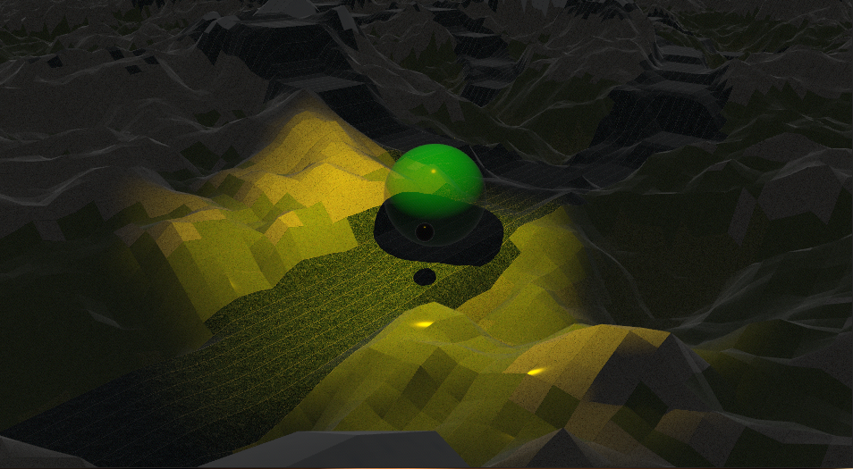

# Artificial Racing

This repository contains a simple physics based racing game that can be controlled externally via grpc requests.
You control a sphere that rolls through a 3d world with hills and valleys. The racing track is flat from left to right. Otherwise, it follows the couture of the world.

The racing track is described by a series of checkpoints that you have to roll through in order.




## Description of the grpc interface
The idea behind the interface is that you can retrieve a view of the world around the sphere under your control and apply a force in the x/z plane to change the movement of the sphere.
The view of the world (`getState`) contains the following fields:
* `surrounding`: a list of (`height`, `kind` (ground type)) tuples describing the 9x9m surrounding of the player with 1 sample per meter. The first entry describes the world at (player.x - 4, player.z -4), the second at (player.x - 3, player.z - 4). If `kind == -1`, the coordinate is not part of the world.
* `y`: the height of the player sphere center
* `distance`: the distance in meters to the next checkpoint center. Checkpoints have a radius of 3m. 0.0 if the last checkpoint was collected.

The input for controlling the sphere (`input`) contains the following fields:
* `x`: force in x direction (in a global coordinate system, independent of the current movement direction)
* `z`: force in z direction (in a global coordinate system, independent of the current movement direction)

The methods `getState` and `input` need to be called in order to step one frame further.
One frame equals 16ms of simulation.

Furthermore, there is a function to retrieve the score (`getScore`), it takes no parameters and terminates the server. It returns the following information:
* `timings`: a list with one entry per collected checkpoint. The number within the list represents the frame number at which the checkpoint was collected.
* `total`: the total amount of existing checkpoints in the world.

There are a few further utility methods:
* `health`: can be called to check if the server has been started yet.
* `kill`: to shut down the server

You can check out the [proto](proto/game.proto) file for the specification.


## Jupyter notebook
We provide a docker image you can run to interact with the game from a jupyter notebook.
```
docker run --rm --net host -v $(pwd)/clients:/opt/clients:Z --name racing julianbieber/artificial-bike-racing:latest  
```

The notebooks contain some scaffolding code that allows you to run the game in headless mode and step through frames and provide game input.
We provide two setups:
* basic: contains functions for interacting with the game, you can use the building blocks to solve the game however you want.
* pygad: contains a basic setup to train a neural network based on genetic algorithm. The example is not sufficient to play the game successfully.


## Game cli

```
Usage: artificial_bike_racing [OPTIONS] --port <PORT> --seed <SEED>

Options:
      --port <PORT>            port used to start the grpc server
      --continuous             if passed, the game does not wait for grpc input. The simulation runs continously
      --headless               if passed, the game will not be rendered
      --seed <SEED>            The seed for world and track generation
      --recording <RECORDING>  path to a previously recorded race. The file contains one player transformation (position + rotation) per frame of the previous run. The recording will be replayed without additional physics simulation
      --color <COLOR>          color for the recorded sphere. This parameter must be passed the same number of times as recording [possible values: red, green, black, white, yellow, blue, grey]
      --save <SAVE>            Path under which to save a recoding
  -h, --help                   Print help information  
```

When you want to run the game headfull for example to view a recording, you need to compile+run it with [cargo](https://rustup.rs/).
```
cargo run --release -- --port 50051 --cont  --seed 2 --recording clients/50059.json --color black
```